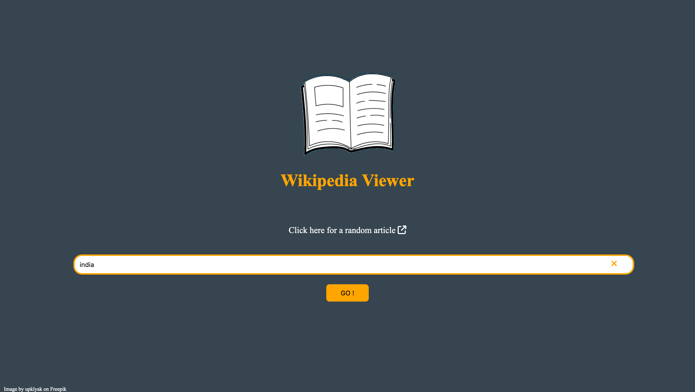

# Wikipedia Viewer App

## Table of contents

- [Overview](#overview)
  - [The challenge](#the-challenge)
  - [Screenshot](#screenshot)
  - [Links](#links)
- [My process](#my-process)
  - [Built with](#built-with)
- [Author](#author)

## Overview

### The challenge

Users should be able to:

- View the optimal layout for the site depending on their device's screen size
- Search anything randomly or specifically
- Should be able to view and select a list of articles based on their search

### Screenshot

#### Design 

### Links

- Live Site URL: [@nees101/Github]( https://nees101.github.io/Wikipedia-Viewer/)

## My process

### Built with

- Semantic HTML5 markup
- CSS custom properties
- jQuery
- English Wikipedia API

## Author

- Frontend Mentor - [@nees101](https://www.frontendmentor.io/profile/nees101)
- Github - [@nees101](https://www.github.com/nees101)
- Website - [@neethunair.com](https://www.neethunair.com)

